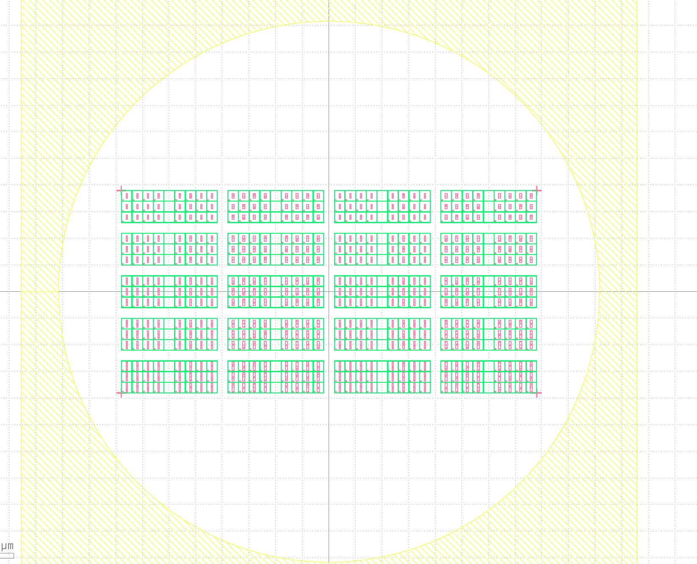
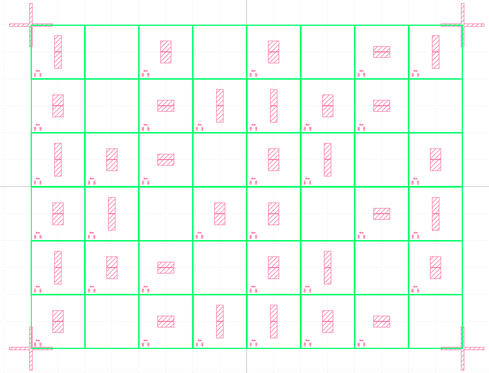

# Quantum GDS Design

Scripts used to produce gds designs with the [PHIDL](https://phidl.readthedocs.io/en/latest/index.html) package are placed in this repository.
There are other packages such as [gdsfactory](https://gdsfactory.github.io/gdsfactory/index.html) and [gdstk](https://heitzmann.github.io/gdstk/) which use similar syntax.


- [Quantum GDS Design](#quantum-gds-design)
  - [Install](#install)
    - [Conda environment](#conda-environment)
  - [How to make your own design?](#how-to-make-your-own-design)
    - [Templates](#templates)
    - [Configuration](#configuration)
    - [Parameter Sweep](#parameter-sweep)
    - [Designs for qiskit-metal](#designs-for-qiskit-metal)
  - [Device details](#device-details)
    - [Layer](#layer)
    - [Feedline](#feedline)


## Install
---

### Conda environment

Use the conda environment to install the phidl package and other useful packages.  
[Link](https://github.com/conda-forge/phidl-feedstock) to some instructions.

```
$ conda config --add channels conda-forge
$ conda config --set channel_priority strict
$ conda create -n phidl python=3.11 
$ conda activate phidl
$ conda install phidl
$ conda install matplotlib
$ conda install pyyaml
$ conda install scipy
```

For Mac users, you can also use the environment.yml to setup the environment

```
$ conda env create -f environment.yml
```

## How to make your own design?
---

- Basics
  - Make a jupyter notebook and use predefined [templates](#templates) to make your own chip design.
  - Configurations passed to the template functions are organized under the ```config``` directory. If you need to modify design parameters, you can directly change the values in the yaml files. Details about the variables are in the  [configuration](#configuration) section.
- Advanced
  - If you need more control for parameter sweeps, define your own chip design function in ```util/ChipDesign.py```. There are several ways to make grid sweeps and details are under the [parameter sweep](#parameter-sweep) section.
  - If you want to pass your gds designs to qiskit-metal, there are some functions which might be helpful. Follow the instructions under the [designs for qiskit-metal](#designs-for-qiskit-metal) section.

### Templates

Functions to produce devices are summarized in ```util/qubit_templates.py```.

|    Function name    |                   Description                   | qiskit-metal compatibility |
| :------------------ | :---------------------------------------------- | :------------------------: |
| device_Wafer        | Return wafer design                             |             x              |
| device_Frame        | Return frames for chip design                   |             x              |
| device_LaunchPad    | Return launch pad design                        |             o              |
| device_Pad          | Return capacitance pads for 3D transmon         |             o              |
| device_FeedLine     | Return feed line which connects two launch pads |             o              |
| device_EntangleLine | Return lines to connect two transmons           |             o              |
| device_DCLine       | Return design for DC line                       |             o              |
| device_CornerPoints | Return boxes placed in the corners              |             x              |
| device_TestAreas    | Return areas to place test JJs                  |             x              |
| device_Resonator    | Return resonator design                         |             o              |
| device_JJ           | Return josephson junction designs               |             x              |

### Configuration

Parameters to configure the designs are organized as yaml files under the ```config``` directory.
Read the config file in your jupyter notebook.

```python
from functions import *
config = load_config( "config/common.yaml" )
```

If you need to read multiple yaml files, you can concatenate multiple configurations by passing a file list to the ```load_config``` function.

```python
from functions import *
config = load_config( ["config/common.yaml", f"config/silicon_2D_silicon.yaml"] ) # If these files include the same keys, the original value will be overwritten by config files on the right side

# # What the function is doing
# common_config = load_config( f"config/common.yaml" )
# config = load_config( f"config/manhattan_2D_silicon.yaml" )
# config = {**common_config, **config} 
```

The ```load_config``` function flattens the dictionary by concatenating the keys  with ```_```.
For example, suppose you have a yaml file like

```yaml
Wafer:
  layer: 21
  inch: 4

LaunchPad:
  layer: 4
  pad:
    length: 300
    width: 200
    gap:
      length: 400
      width: 500
  trace:
    length: 200
    width: 20
    gap:
      width: 11
```

This will be converted to a dictionary like

```python
config = {
 'Wafer_layer': 21,
 'Wafer_inch' : 4,
 'LaunchPad_layer'          : 4,
 'LaunchPad_pad_gap_length' : 400,
 'LaunchPad_pad_gap_width'  : 500,
 'LaunchPad_pad_length'     : 300,
 'LaunchPad_pad_width'      : 200,
 'LaunchPad_trace_gap_width': 11,
 'LaunchPad_trace_length'   : 200,
 'LaunchPad_trace_width'    : 20
}
```

Variables defined in the dictionary can be swept by parameter sweeps.
Use the concatenated variable names when you need to run a parameter sweep.


You may want to pass some objects defined by PHIDL, such as ```pp.arc``` when connecting two ports.
The ```functions.py``` has a ```STRING_TO_OBJECT``` dictionary, which checks for specific strings and convert them to the corresponding objects.


### Parameter Sweep

You can place your chip designs in a grid, while sweeping variables defined in your configuration file.
To activate the parameter sweep, you just need to add ```D = sweep_chipdesign( config )```, which returns chip designs placed in a grid.
Below is an example of how you can define a parameter sweep.

```yaml
Grid:
  name: "transmon3D"
  layer: 9
  lines:
    x: 12
    y: 10
  sweep:
    ## If you have many parameters to sweep, use gridsweep to make a 2D array
    type: "gridsweep"
    array:
      - param_x: "JJ_finger_width"
        param_y: "dummy"
        x: [0.10, 0.12, 0.14, 0.16, null, 0.18, 0.20, 0.25, 0.3]
        y: [0.3, 0.3, 0.3]
        gap_x: 0
        gap_y: 0
      - param_x : "Pad_width"
        param_y : "Pad_height"
        x: [250, 400]
        y: [400, 500, 600, 700, 800]
        gap_x: 1
        gap_y: 1
      - param_x : "JJ_squid"
        param_y : "dummy"
        x: [true, false]
        y: [0]
        gap_x: 1
        gap_y: 1
```

The example uses the ```chipdesign_transmon3D()``` function defined in ```util/ChipDesign.py```.
The ```array``` part is where you can define multiple parameter sweeps.

1. In the example, a 9x3 grid will be defined by sweeping ```JJ_finger_width``` in the x-axis, and placing the same designs in the y-axis by assigning ```dummy``` to the ```param_y```.
2. The next element will take the 9x3 grid defined in 1., and sweep the ```Pad_width``` and ```Pad_height``` in the x- and y-axis, and define a large 2x5 grid. Each cell contains the 9x3 grid and there is a gap between the cells.
3. The last element will take the 19x19 grid defined in 2., and sweep the ```JJ_squid``` in the x-axis. This results in a group with SQUID transmons on the left side, and single transmons on the right side.



If you want more manual access to the parameter sweep, you can rewrite the configuration as below using the ```array``` type sweep.

```yaml
Grid:
  name: "transmon3D"
  layer: 9
  lines:
    x: 12
    y: 10
  sweep:
    # More manual way to place chip designs
    # Place arguments in the array, where you want samples
    # Put "null" if you want an empty cell
    type: "array"
    devices:
      - JJ_finger_width: 0.10
        Pad_width : 250
        Pad_height : 600
      - JJ_finger_width: 0.15
        JJ_squid: true
        Pad_width : 400
      - JJ_finger_width: 0.15
        JJ_squid: true
        Pad_width : 600
        Pad_height : 200
    array: [
      [0    , null  , 1     , null, 1    , null  , 2     , 0   ],
      [1    , null  , 2     , 0   , 0    , 1     , 2     , null], 
      [0    , 1     , 2     , null, 1    , 0     , null  , 1   ],
      [1    , 0     , null  , 1   , 1    , null  , 2     , 0   ], 
      [0    , 1     , 2     , null, 1    , 0     , null  , 1   ],
      [1    , null  , 2     , 0   , 0    , 1     , 2     , null], 
    ]
    gap_x : 0
    gap_y : 0
```

First, you need to define the ```devices```, which you would like to place in the grids.
In the example, you have three types of devices with different ```JJ_finger_width```, ```JJ_squid```, ```Pad_width``` and ```Pad_height```.
After defining the ```devices```, define a 2D ```array``` with numbers which corresponds to the device index.
If you assign ```null``` to a cell, there will be no device in a cell.



If you want to sweep combinations of variables in a single sweep, you can assign list to ```param_x``` or ```param_y```.
Below is an example to sweep combinations.

```yaml
Grid:
  name: "TcSample"
  layer: 9
  lines:
    x: 16
    y: 10
  sweep:
    type: "gridsweep"
    array:
      - param_x: ["Resonator_devices:0:n_step", "Resonator_devices:1:n_step"]
        param_y: ["Resonator_devices:0:norm_to_frequency", "Resonator_devices:1:norm_to_frequency"]
        x: [[3, 3], [4, 4], [5, 5]]
        y: [[6500, 7500], [7000, 8000], [7500, 8500], [8000, 9000]]
        gap_x: 0
        gap_y: 0
      - param_x: ["Resonator_devices:0:feedline_gap", "Resonator_devices:1:feedline_gap"]
        param_y: "dummy"
        x: [[10, 10], [13, 13], [20, 20], [30, 30]]
        y: [0, 0]
        gap_x: 1
        gap_y: 1
```

### Designs for qiskit-metal

The BaseDevice class in ```util/BaseDevice.py``` is used to produce designs for qiskit-metal.
Users need to provide the following designs.

1. device : Lithography area.
2. pocket : Area which includes the lithography and gap area.
3. metal  : Area which will be evaporated with metal. The area does not include the ground plane. The metal area is usually produced by subtracting the pocket area by the device area.

The BaseDevice class has its own functions to move and rotate all of the designs at the same time.

The device functions inherit the BaseDevice class.
After making the objects, you can pass them to the ```phidl_to_metal()``` function to produce gds and yaml files.
These files can be processed by qiskit-metal to produce your own QComponents and can be easily passed to HFSS simulations.

```python
device_list = [
    dict(device = FL, name = "FeedLine"),
    dict(device = R1, name = "Resonator1"),    
    dict(device = R2, name = "Resonator2"),
]

phidl_to_metal(
    device_list = device_list, 
    outname = "TcSampleDesign"
)
```

After converting PHIDL to qiskit-metal designs, you can find the output files under ```output/qiskit-metal/```.

## Device details

### Layer

Layer numbers for each device are configured in the yaml file.
Numbers below 10 are basically the ones you need to assign for lithography.

| Device name | Layer Number |
| :---------- | :----------- |
| Grid line   | 9            |
| Wafer       | 21           |
| Chip Frame  | 25           |


### Feedline

input & output
- type : LaunchPad, OpenToGround, ShortToGround

path
- straight, J ...
- manual
- extrude